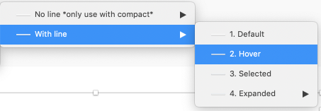
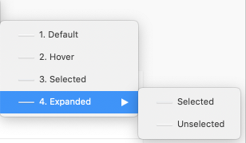

# Table and Data list enhancements for hover and selection
[Design kit issue](https://github.com/patternfly/patternfly-design-kit/issues/140#event-2948552735)

[Examples Marvel link](https://marvelapp.com/dfbie31)

## What’s the problem? 

Because of the many variations of table rows, creating a solution for these table rows is proving complicated to not only create as a contribution, but also to use (requires several drill-downs, making it difficult to create tables).

## Design

Instead of having table rows be symbols that contain the visuals for state and expansion in one, we should have table rows consisting of two symbols : a background symbol that you choose your state with and a content symbol that gives you sizing and choice of expansion. A table row would be made like this:

### Step 1: Choose your styling + state

1. Do you want a row divider line? 

2. What state is this row in? If the row is ‘Expanded’, you then would choose from there if it’s expanded and selected or expanded and unselected.

 
  
3. Now you should have a the correct background: I used a hover background

### Step 2: Choose your row functionality

1. Is it compact or standard size?
	
2. Is it expandable?

	
3. Now you should have the correct toggles and spacing for your row. 
	
### Step 3: Put it the row together

1. Size your background so that it’s the correct height (symbol defaults to 72px -- the height 
of a one-line standard size row). 

2. Place the functionality layer on top of the background layer, and place your text, content, 
and more on top of that. Volia! 
