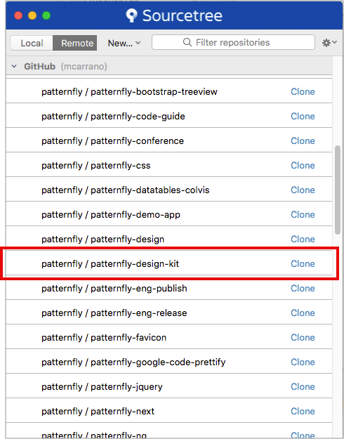
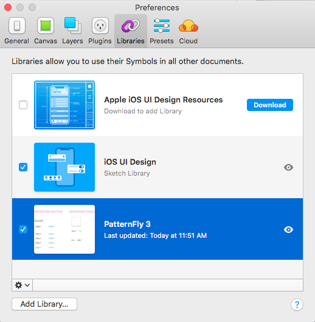
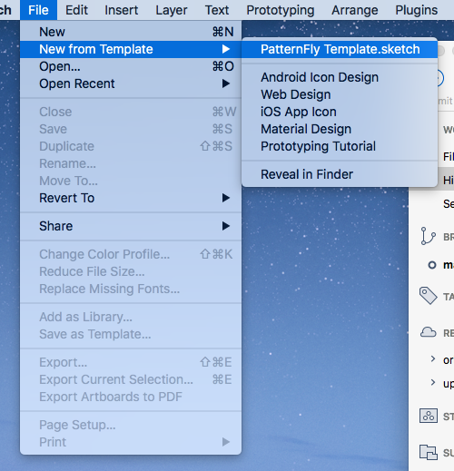
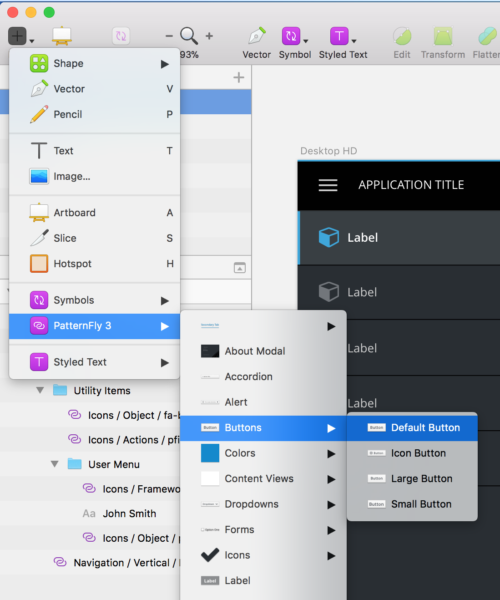
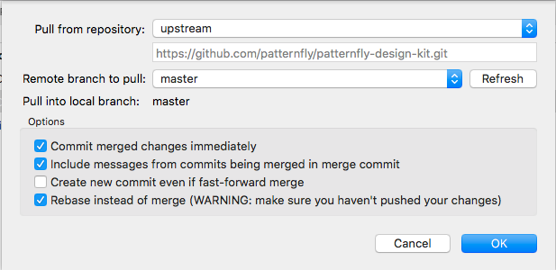

# Patternfly Design Kit

The PatternFly Design Kit is a collection of [Sketch](https://www.sketchapp.com/) assets that make it easy for designers to create high-fidelity design mockups that accurately represent [PatternFly](http://patternfly.org) components and layouts. It includes:

* A Sketch symbol library that includes components, icons, color palettes, and other PatternFly elements.
* A template file that provides several starter layouts that will make it easier to construct common PatternFly screens.

By using these file to create your designs, mockups will always be kept up to date with the latest PatternFly styling as Skecth will automatically notify you of any symbol changes when you open a Skecth source file that was created using the library. We recommend using the design kit any time you need to create high-fidelity product mockups using Sketch. 

## Get Started with the PatternFly Design Kit

### Working with Sketch Libraries
Libraries were introduced in Skecth 47 as a tools for creating custom symbols that can be shared across a variety of projects. You must have Sketch version 47 or above installed to use this capability. You can read more about the capabilities of Sketch Libraries here: https://www.sketchapp.com/docs/libraries/.

### First Time Setup and Installation
To use the Design Kit in Sketch, start by cloning a copy of this repo to your local machine. For this you will need [SourceTree](https://www.sourcetreeapp.com/) or a similar tool installed to maintain the local copy of this repo. If you have never set this up, we recommend reading [this article](https://github.com/patternfly/patternfly-design/wiki/How-to-Setup-your-Contribution-Environment) for more information about using GitHub with PatternFly Design. Once you have Sourcetree installed and connected to your GitHub account, you should follow these steps to clone this repo.

1. From the SourceTree main window, click on the Remote tab, scroll to 'patternfly/patternfly-design-kit' and click Clone. This will ask you for a directory where you would like the Design Kit files to live on your local machine. Upon clicking Clone, the files will be copied to your local drive.

2. In Sketch, open Preferences and click the Libraries tab. This will show you all the libraries that are installed in your instance of Sketch. Next click **Add Library...**
3. In the file browser, go to the location where you cloned the PatternFly Design Kit repo to and select the 'PatternFly 3.sketch' file. This will install the PatternFly 3 component library into your instance of Sketch. 

4. Open the file 'PatternFly Template.sketch' and save it as a template (**File>Save as Template...**)

That's it. Your PatternFly Design Kit is now set up! To use the template, create a new file by selecting **File>New from Template** and select the PatternFly Template. This will provide you with a starter set of common page layouts and access to symbols that you can use in your new Sketch file. 

When you click on the Insert menu in Skecth, you will be able to access PatternFly symbols for use in your design.

One last note. You should never make updates directly to either the library or the template files that you installed as part of this process. If you need to create new symbols to use within a specific project, we recommend creating those directly in your project file. The will ensure that you maintain a consistent set of shared assets and that your changes are not overwritten when you pull down updates to the PatternFly Design Kit.

### Updating the PatternFly Design Kit
The PatternFly Design Kit will continue to evolve and grow as new components and patterns are added. Updates will take place on a rolling basis. While we will periodically announce updates to the community, we recommend that at the start of a project, you ensure that you are working with the latest library and template files by updating your local copy. If you are using SourceTree, simply open the patternfly-design-kit repo and do a Pull from the upstream repository.

When you open an existing file that uses PatternFly symbols, Sketch will notify you of any changes and allow you to apply and changes to your project. In this way, any changes to PatternFly look and feel can be easily deployed to your project design files without needing to do manual updates. To learn more about how this works, read about [Library Updates](https://www.sketchapp.com/docs/libraries/library-updates) in the Sketch online user guide.

## Contributing to the PatternFly Design Kit
We welcome contributions from our community of PatternFly designers. More information about how to make a contribution will be forthcoming. But in the mean time, if you are interested in helping us to build out this library, please contact Matt Carrano, [mcarrano@redhat.com](mailto:mcarrano@redhat.com), or Kyle Baker, [kybaker@redhat.com](mailto:kybaker@redhat.com).
